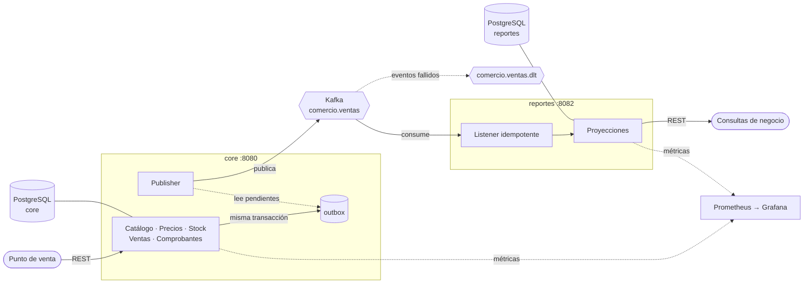

# comercio

[](https://github.com/frangmz09/comercio/actions/workflows/ci.yml)
[](https://comercio-core.onrender.com/swagger-ui)

Core transaccional de un comercio minorista: catálogo, precios con vigencia temporal,
control de stock, ventas y comprobantes, más un servicio de reportes que se entera de
todo por eventos.

Está construido alrededor de las reglas que un sistema de gestión real tiene que
sostener y que un CRUD no cubre: que el stock nunca quede negativo aunque dos cajas
vendan el mismo producto en el mismo instante; que reimprimir una venta de hace seis
meses devuelva el precio que regía ese día; que la numeración de comprobantes no tenga
huecos; y que un punto de venta pueda reintentar una operación sin cobrar dos veces.

> El dominio es sintético. Es un proyecto propio, sin relación con ningún sistema de un
> empleador. Ver [Sobre los datos](#sobre-los-datos).

## Arquitectura



Dos servicios desplegables por separado, cada uno dueño de su base. No comparten tablas
ni se llaman entre sí: la única vía de comunicación son los eventos. `reportes` nunca vio
la tabla `producto` de `core` — por eso los eventos viajan con SKU y no con ids internos.

## Qué resuelve

**Catálogo.** Productos identificados por SKU. No se borran: se desactivan, porque hay
movimientos y ventas históricas que los referencian.

**Precios con vigencia.** Un producto no tiene *un* precio: tiene uno por lista
(minorista, mayorista, un convenio) y cada uno rige durante una ventana de tiempo.
Cargar un precio nuevo no pisa al anterior, lo cierra.

**Stock.** El saldo es la consecuencia de un libro de movimientos que nunca se edita. Una
corrección de inventario no modifica el pasado: agrega un ajuste. Una salida que dejaría
el saldo negativo se rechaza, incluso bajo concurrencia.

**Ventas.** Resuelven el precio vigente, descuentan el stock, calculan el total y emiten
la factura en una sola transacción. Cada línea congela el precio con el que se vendió.

**Comprobantes.** Cada punto de venta numera por separado y sin huecos. Una venta se
revierte con una nota de crédito que devuelve la mercadería y apunta a la factura
original — nunca editando o borrando lo ya emitido.

**Reportes.** Ventas por día y productos más vendidos, proyectados desde los eventos.
Son eventualmente consistentes: una venta recién registrada tarda un instante en aparecer.

## Demo pública

### 👉 [comercio-core.onrender.com/swagger-ui](https://comercio-core.onrender.com/swagger-ui)

La API transaccional está desplegada y se puede probar desde el navegador. Hay un
producto, una lista de precios y un punto de venta ya cargados para arrancar sin trámite.

> **El primer request puede tardar cerca de un minuto.** Corre sobre una instancia
> gratuita que se duerme tras 15 minutos sin tráfico; el contenedor tiene que volver a
> levantar. Después responde normal.

Ahí solo vive `core`. `reportes` necesita Kafka, y no hay un Kafka gestionado gratuito
que se sostenga en el tiempo, así que el sistema completo —los dos servicios, Kafka,
Prometheus y Grafana— se levanta local con un comando.

Un recorrido rápido sin salir de la terminal:

```bash
# Los productos cargados
curl https://comercio-core.onrender.com/api/v1/productos

# Una salida mayor al stock se rechaza con 409: nunca queda negativo
curl -X POST https://comercio-core.onrender.com/api/v1/stock/movimientos \
  -H "Content-Type: application/json" \
  -d '{"productoId":"{productoId}","tipo":"SALIDA","cantidad":99999,"motivo":"prueba"}'
```

## Cómo correrlo

Requiere Docker.

```bash
docker compose up --build
```

Levanta los dos servicios, sus dos bases, Kafka, Prometheus y Grafana:

| | |
|---|---|
| API de `core` | http://localhost:8080/api/v1 · [Swagger](http://localhost:8080/swagger-ui) |
| API de `reportes` | http://localhost:8082/api/v1 · [Swagger](http://localhost:8082/swagger-ui) |
| Grafana | http://localhost:3000 — dashboard *comercio — operación* |
| Prometheus | http://localhost:9090 |

## La API

### `core` — catálogo, precios, stock

| Método | Ruta | Qué hace |
|---|---|---|
| `POST` | `/api/v1/productos` | Da de alta un producto |
| `GET` | `/api/v1/productos` | Lista paginada, filtrable por `categoria` e `incluirInactivos` |
| `POST` | `/api/v1/productos/{id}/desactivar` | Lo saca del catálogo activo sin borrarlo |
| `POST` | `/api/v1/listas-precio` | Crea una lista (minorista, mayorista…) |
| `POST` | `/api/v1/listas-precio/{id}/precios` | Asigna un precio y cierra la vigencia del anterior |
| `GET` | `/api/v1/listas-precio/{id}/precios/vigente` | Precio que rige en un `momento` dado |
| `GET` | `/api/v1/listas-precio/{id}/precios/historial` | Todos los precios, del más nuevo al más viejo |
| `POST` | `/api/v1/stock/movimientos` | Registra `ENTRADA`, `SALIDA` o `AJUSTE` |
| `GET` | `/api/v1/stock/{productoId}` | Saldo actual |

### `core` — ventas y comprobantes

| Método | Ruta | Qué hace |
|---|---|---|
| `POST` | `/api/v1/puntos-venta` | Crea un punto de venta con su propia numeración |
| `POST` | `/api/v1/ventas` | Registra una venta. **Requiere header `Idempotency-Key`** |
| `GET` | `/api/v1/ventas/{id}` | Venta con sus líneas y comprobantes |
| `POST` | `/api/v1/ventas/{id}/nota-credito` | Revierte la venta y devuelve el stock |
| `GET` | `/api/v1/comprobantes/{id}` | Comprobante emitido |

### `reportes`

| Método | Ruta | Qué hace |
|---|---|---|
| `GET` | `/api/v1/reportes/ventas-diarias` | Vendido, anulado y neto por día |
| `GET` | `/api/v1/reportes/mas-vendidos` | Los diez productos con más unidades |

Todos los errores tienen la misma forma, sin importar dónde se originaron:

```json
{
  "timestamp": "2026-08-13T01:17:32.955Z",
  "status": 409,
  "error": "Conflict",
  "message": "Stock insuficiente: hay 3 y se intentan descontar 5",
  "path": "/api/v1/stock/movimientos",
  "validationErrors": null
}
```

### Un flujo completo

```bash
# 1. Producto, lista de precios y punto de venta
curl -X POST http://localhost:8080/api/v1/productos \
  -H "Content-Type: application/json" \
  -d '{"sku":"ALM-001","nombre":"Fideos 500g","categoria":"Almacén","unidad":"unidad"}'

curl -X POST http://localhost:8080/api/v1/listas-precio \
  -H "Content-Type: application/json" \
  -d '{"codigo":"MINORISTA","nombre":"Minorista"}'

curl -X POST http://localhost:8080/api/v1/puntos-venta \
  -H "Content-Type: application/json" \
  -d '{"numero":1,"nombre":"Caja 1"}'

# 2. Su precio y su stock
curl -X POST http://localhost:8080/api/v1/listas-precio/{listaId}/precios \
  -H "Content-Type: application/json" \
  -d '{"productoId":"{productoId}","monto":1250.00}'

curl -X POST http://localhost:8080/api/v1/stock/movimientos \
  -H "Content-Type: application/json" \
  -d '{"productoId":"{productoId}","tipo":"ENTRADA","cantidad":100,"motivo":"compra a proveedor"}'

# 3. Una venta. La clave la genera el cliente para poder reintentar sin duplicar.
curl -X POST http://localhost:8080/api/v1/ventas \
  -H "Content-Type: application/json" \
  -H "Idempotency-Key: caja-1-20260813-000417" \
  -d '{"listaPrecioId":"{listaId}","puntoVentaId":"{pvId}","lineas":[{"productoId":"{productoId}","cantidad":3}]}'

# 4. Repetir el paso 3 con la misma clave devuelve la MISMA venta y no descuenta de nuevo

# 5. El stock bajó a 97 y el reporte ya refleja la venta
curl http://localhost:8080/api/v1/stock/{productoId}
curl http://localhost:8082/api/v1/reportes/ventas-diarias

# 6. Una salida mayor al saldo se rechaza con 409 — el stock nunca queda negativo
curl -X POST http://localhost:8080/api/v1/stock/movimientos \
  -H "Content-Type: application/json" \
  -d '{"productoId":"{productoId}","tipo":"SALIDA","cantidad":99999,"motivo":"venta"}'

# 7. La nota de crédito devuelve la mercadería y anula la venta
curl -X POST http://localhost:8080/api/v1/ventas/{ventaId}/nota-credito \
  -H "Content-Type: application/json" \
  -d '{"puntoVentaId":"{pvId}","motivo":"devolución del cliente"}'
```

## Cómo funciona por dentro

**El no solapamiento de precios lo garantiza la base, no el código.** Una constraint
`EXCLUDE USING gist` sobre `tstzrange(vigencia_desde, vigencia_hasta)` impide que un
producto tenga dos precios simultáneos en la misma lista. El servicio cierra la vigencia
anterior al cargar una nueva, pero eso solo alcanza si nadie escribe en paralelo: bajo
concurrencia, dos transacciones leen el mismo estado y ambas insertan.

**El saldo de stock existe para poder bloquearlo.** Se podría calcular con un `SUM()`
sobre los movimientos, pero eso obliga a recorrer todo el historial en cada venta y, más
importante, no deja una fila sobre la cual serializar. El saldo materializado permite un
`SELECT ... FOR UPDATE` que ordena a dos ventas simultáneas del mismo producto. El lock
se toma *antes* de validar: leer el saldo, concluir que alcanza y recién después
descontar es exactamente cómo se sobrevende. Como última red hay un
`CHECK (cantidad >= 0)` en la tabla.

**Las ventas ordenan sus líneas antes de tocar el stock.** Dos ventas con los mismos
productos en distinto orden tomarían los locks en distinto orden y podrían quedar
trabadas mutuamente. Con un orden total y estable por id de producto, la segunda espera a
la primera en lugar de abrazarse con ella.

**La idempotencia se apoya en una clave primaria, no en un `if`.** El chequeo previo
cubre el caso normal —el punto de venta no recibió respuesta y reintenta segundos
después—, pero dos reintentos simultáneos lo pasan los dos. La PK de
`clave_idempotencia` es lo que finalmente garantiza que solo una venta quede registrada.

**La numeración de comprobantes es una tabla, no una `SEQUENCE`.** Las secuencias de
Postgres no son transaccionales: si la venta se revierte, el número queda quemado y
aparece un hueco. En un comprobante eso no es un detalle estético, es algo que después
hay que justificar. La reserva es un `INSERT … ON CONFLICT DO UPDATE … RETURNING`: una
sola sentencia atómica.

**El outbox evita el dual-write.** El evento se escribe en la misma transacción que la
venta, y un publisher aparte lo manda a Kafka. Publicar directamente desde el servicio
sería escribir en dos sistemas que no comparten transacción: la venta puede commitear y
el publish fallar —evento perdido, el reporte nunca se entera— o el publish puede salir y
la transacción revertirse —evento fantasma, el reporte cuenta una venta que no ocurrió.

**El consumidor es idempotente porque tiene que serlo.** El outbox entrega
*at-least-once*: si el envío sale pero el proceso muere antes de marcar la fila, el
evento se republica. `reportes` descarta los repetidos contra la PK de
`evento_procesado`, y la marca se escribe en la misma transacción que la proyección, para
que un fallo revierta las dos cosas juntas.

**Un evento defectuoso no bloquea la partición.** Tras unos reintentos va al dead letter
topic. El comportamiento por defecto —reintentar sobre el mismo registro para siempre—
haría que un solo evento ilegible frene a todos los que vienen detrás.

**Flyway es dueño del esquema.** Hibernate corre con `ddl-auto: validate`: solo verifica
que las entidades coincidan con lo que las migraciones crearon.

### Estructura

Paquetes por feature, no por capa técnica: cada módulo es una rebanada vertical con su
propio controlador, servicio, repositorio y entidades.

```
comercio/
├── contratos/     eventos compartidos entre los dos servicios
├── core/          producto · precio · stock · venta · comprobante · outbox
├── reportes/      consumo · proyeccion · api
└── observabilidad/  Prometheus y dashboard de Grafana
```

## Tests

```bash
./mvnw verify
```

Unitarios (Surefire) e integración (Failsafe) en la misma pasada. Los de integración
levantan PostgreSQL y Kafka reales con Testcontainers, así que requieren Docker. La
cobertura queda en `*/target/site/jacoco/`.

Los que importan no son los del CRUD:

| Test | Qué demuestra |
|---|---|
| `StockConcurrenciaIT` | 12 hilos compiten por el último ítem: con stock para 6, exactamente 6 ganan y el saldo queda en 0 |
| `NumeracionComprobanteIT` | 16 emisiones concurrentes producen la secuencia exacta 1..16, sin huecos ni repetidos |
| `VentaIT` | 8 reintentos simultáneos con la misma clave descuentan el stock una sola vez |
| `VentaIT` | Si falla la última línea por stock, la primera tampoco descuenta: la venta es atómica |
| `OutboxIT` | Una venta fallida no deja ningún evento anunciándola |
| `ConsumoEventosIT` | El mismo evento aplicado dos veces proyecta una sola; uno ilegible va al DLT sin frenar al siguiente |

## Integración continua

GitHub Actions corre en cada push: build, tests con Testcontainers, cobertura JaCoCo y
análisis de SonarCloud.

El repositorio incluye además un `Jenkinsfile` con las mismas etapas y un
`docker-compose.jenkins.yml` para levantar un Jenkins local y ejecutarlo:

```bash
docker compose -f docker-compose.jenkins.yml up
```

## Alcance

Es un core transaccional, no un ERP completo. Deliberadamente **no** incluye facturación
fiscal (AFIP/ARCA), multi-tenancy, cuentas corrientes, compras y proveedores, caja y
arqueo, ni interfaz gráfica: la superficie de uso es la API y su documentación OpenAPI.

En infraestructura tampoco hay Kubernetes ni service discovery. Con dos servicios eso
sería infraestructura sin un problema que resolver.

## Stack

Java 21 · Spring Boot 3 · Spring Data JPA · Spring Kafka · Bean Validation · PostgreSQL ·
Flyway · Kafka (KRaft) · JUnit 5 · Mockito · Testcontainers · AssertJ · Awaitility ·
JaCoCo · Micrometer · Prometheus · Grafana · springdoc-openapi · Docker · GitHub Actions

## Sobre los datos

Todo el dominio —productos, precios, stock, ventas— es sintético y genérico de retail.
Este repositorio es un ejercicio propio, sin relación con ningún sistema de un empleador
actual o anterior.

## Licencia

[MIT](LICENSE)
